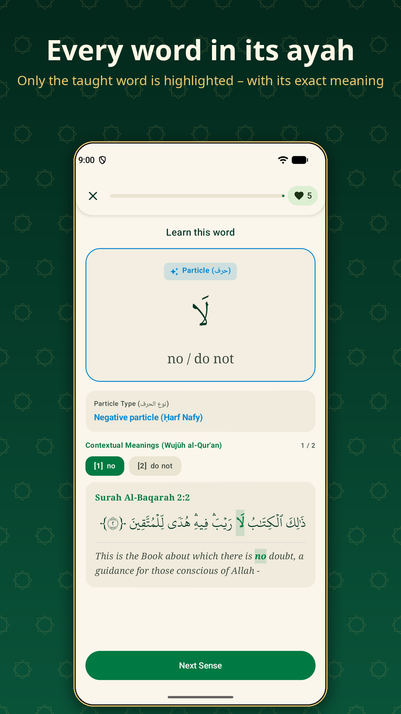
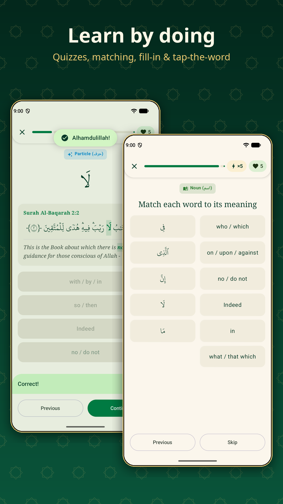
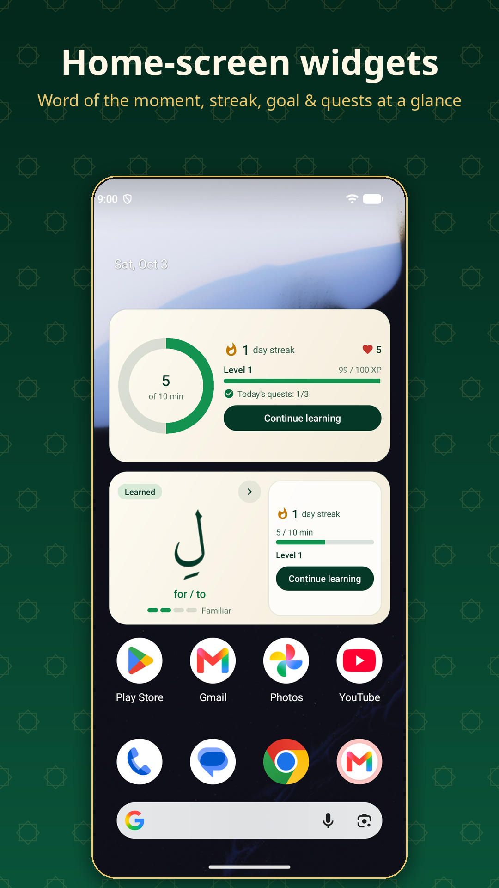
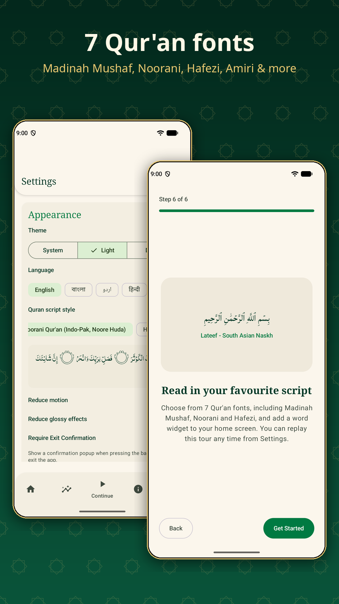

# QuranicWords: learn the vocabulary of the Qur'an, word by word

<p align="center">
  
</p>

<p align="center">
  <strong>3,833 Qur'anic Arabic words, 97.4% of the Qur'an's text, taught in order of frequency.<br>
  Every meaning is shown in its complete ayah, in 8 languages. Free, open source, 100% offline.</strong>
</p>

<p align="center">
  <a href="https://quranicwords.vercel.app/"></a>
  <a href="https://github.com/deanybytes/QuranicWords/releases/latest"></a>
  <a href="dataset/"></a>
</p>

<p align="center">
  
  
  
  
  
  
</p>

QuranicWords helps you **understand the Qur'an in Arabic** by learning its words: the most
frequent first, each one in a real ayah with only that word highlighted. It is a Quran
vocabulary course, a word-by-word Quran dictionary and a Qur'anic Arabic roots explorer, in
**English, বাংলা (Bangla), اردو (Urdu), हिन्दी (Hindi), Bahasa Indonesia, Türkçe, فارسی (Persian)
and Français**.

- 📱 **Android app**: short lessons, spaced-repetition review, quizzes, streaks, quests and
  home-screen widgets. [Download the APK](https://github.com/deanybytes/QuranicWords/releases/latest).
- 🌐 **Web app**: the same curriculum in any browser, installable and offline after the first
  visit. [quranicwords.vercel.app](https://quranicwords.vercel.app/), also at
  [deanybytes.github.io/QuranicWords](https://deanybytes.github.io/QuranicWords/).
- 📖 **A page for every word and root**: [Qur'anic words](https://quranicwords.vercel.app/quran-words/)
  and [Qur'anic roots](https://quranicwords.vercel.app/quran-roots/), with meanings in all 8
  languages and a complete ayah.
- 🗂️ **Open dataset**: the whole vocabulary as JSON and CSV in [`dataset/`](dataset/), free to reuse.
- 💾 **Offline HTML dictionary**: one file, no install: `QuranicWords-v1.0.0.html` on the
  [releases page](https://github.com/deanybytes/QuranicWords/releases/latest).

> 🔒 **Private by design.** No account, no ads, no analytics. The Android app has no Internet
> permission, and your progress never leaves your device.
> 🕋 **No human faces** in any image, and **no scripture as decoration**: Qur'anic text appears
> only as lesson content.

<p align="center">
  
  
  
  
</p>

---

## Contents

- [The curriculum](#the-curriculum) · [How a lesson teaches](#how-a-lesson-teaches) · [Staying motivated](#staying-motivated)
- [Qur'an fonts](#quran-fonts) · [Where the meanings come from](#where-the-meanings-come-from)
- [Open dataset](#open-dataset) · [Rebuild it yourself](#rebuild-it-yourself-no-coding-needed) · [Build from source](#build-from-source-developers) · [Repository layout](#repository-layout)
- [Documentation](#documentation) · [Contributing, licence and contact](#contributing-licence-and-contact)

## The curriculum

**10 chapters, 78 sections, 943 lessons and 15,329 exercises.** Each chapter is a single part
of speech (*Aqsām al-Kalimah*). Verb and noun chapters alternate by frequency band, so اللَّه,
رَبّ and يَوْم come early.

| Ch | Title | Words | Share of the Qur'an |
|---|---|---|---|
| 1 | Particles & Function Words | 66 | 46.2% |
| 2 | Essential Verbs | 150 | 14.4% |
| 3 | Essential Nouns | 250 | 22.9% |
| 4 | Common Verbs | 250 | 3.2% |
| 5 | Common Nouns | 500 | 5.3% |
| 6 | Frequent Verbs | 350 | 1.3% |
| 7 | Frequent Nouns | 650 | 2.2% |
| 8 | Further Verbs | 369 | 0.5% |
| 9 | Further Nouns | 650 | 0.9% |
| 10 | Rare & Unique Nouns | 598 | 0.6% |

Together the 3,833 words cover **97.4%** of the Qur'an's words and attached particles (94,618
occurrences). Each section has up to 10 lessons of 5 words, then a review and an exam. Exams need
80% on **first-try** answers, and each chapter ends with a chapter exam.

Every word comes with its root, its grammar label (for verbs: form, past, present and maṣdar),
its frequency, and its contextual senses (*Wujūh*). Each sense has its own complete ayah.

## How a lesson teaches

Every word is **taught first, then quizzed** straight away (retrieval practice):

| Step | Interaction | Scored |
|---|---|---|
| 📖 Learn | The word, meaning, root, forms and senses, in a complete ayah with the word highlighted | No |
| 🔤 Meaning | Pick the meaning of the Arabic word | Yes |
| ✏️ Verse | Complete the ayah with the missing word, or tap the word that has this meaning | Yes |
| 🔗 Match | Pair the lesson's words with their meanings | Yes |

Distractors come from the same chapter and never share the answer's written form, root or any
meaning in any language, so there is always exactly one defensible answer.

## Staying motivated

- **Daily Review** (spaced repetition, FSRS): Home shows how many words are due. Each word's memory
  strength runs New → Learning → Familiar → Strong → Mastered.
- **XP and levels**, combo bonuses, optional **hearts**, three **daily quests**, **streaks** with a
  daily-goal ring, **achievements** and celebrations (which respect *reduce motion*).
- **Home-screen widgets**: a rotating word card (due, learned or next new word), your stats, or both together, in four sizes.
- **Interactive tour** for new learners, replayable from Settings.
- **Test-only mode** with Ism, Fiʿl, Ḥarf, Mix, Mistakes and chapter practice.

## Qur'an fonts

Seven real typefaces, each rendering the full Uthmani text including pause marks (ۖ ۗ ۚ), open
tanween and the ayah-end mark:

| Style | Typeface | Licence |
|---|---|---|
| Madinah Mushaf (default) | KFGQPC Uthmanic Script Hafs | KFGQPC end-user licence |
| Classic calligraphic Naskh | Amiri | SIL OFL 1.1 |
| Traditional Naskh | Scheherazade New | SIL OFL 1.1 |
| Modern clean Naskh | Noto Naskh Arabic | SIL OFL 1.1 |
| South Asian Naskh | Lateef | SIL OFL 1.1 |
| Noorani Qur'an (Indo-Pak) | Noore Huda | NooreHidayat (free redistribution) |
| Hafezi Qur'an (Indo-Pak 15-line) | Noore Hira | NooreHidayat (free redistribution) |

With the two Indo-Pak fonts, five marks are shown in their Indo-Pak form (alif waṣla as alif, jazm,
closed tanween), one character for one.

## Where the meanings come from

The whole curriculum is built by one reproducible pipeline, [`tools/pipeline`](tools/pipeline/README.md),
from pinned sources (every download is checked against its sha256):

- **Lemmas, roots, grammar and frequencies:** the [Quranic Arabic Corpus](https://corpus.quran.com)
  morphology (GPL).
- **Meanings:** the Greentech Apps Foundation word-by-word translations. A word's meaning is
  voted from its own clean occurrences in each language, so it is never a neighbouring word or a
  phrase fragment. A word ships only if all 8 languages pass the checks.
- **Verse translations:** published editions from alquran.cloud and quran.com, one per language.
- **Verse text:** every cited ayah is verified to be complete against the Tanzil Uthmani text.

Details and licences: [`docs/CONTENT_SOURCES.md`](docs/CONTENT_SOURCES.md) and [`NOTICE`](NOTICE).

## Open dataset

[`dataset/`](dataset/) contains everything the apps teach, ready for research, other apps,
flashcards or analysis:

| File | Contents |
|---|---|
| `words.json` / `words.csv` | 3,833 lemmas: Arabic, root, part of speech, verb forms, frequency, curriculum position, meanings and senses in 8 languages |
| `roots.json` / `roots.csv` | 1,423 roots with their words and total occurrences |
| `verses.json` | the 4,839 ayahs the senses cite: Uthmani text, word-by-word gloss and full translation in 8 languages, with exact character spans |
| `metadata.json` | counts, languages, sources with their pinned sha256 |

It is also attached to every release as `QuranicWords-dataset-v1.0.0.zip`. See
[`dataset/README.md`](dataset/README.md) for the schema, licence and how to cite it.

## Rebuild it yourself (no coding needed)

The complete source of the Android app, the web app, the content pipeline and the store assets
is in this repository, so anyone can rebuild everything:

1. **Just want the app?** Download the APK or the offline HTML from the
   [releases page](https://github.com/deanybytes/QuranicWords/releases/latest).
2. **Build it in the cloud, nothing to install:** fork this repository, open **Actions → Build
   APK → Run workflow**, and download `QuranicWords-debug-apk` from the finished run.
3. **Build it on your computer with one command** (Linux or macOS, JDK 17+; a missing Android SDK
   is downloaded for you):

   ```bash
   git clone https://github.com/deanybytes/QuranicWords.git
   cd QuranicWords
   ./build.sh            # -> build/QuranicWords-debug.apk
   ```

   | Command | Does |
   |---|---|
   | `./build.sh` | Android app, debug APK |
   | `./build.sh release` | release APK (debug-signed unless you add your own keystore, see [SECURITY.md](SECURITY.md)) |
   | `./build.sh content` | rebuild the curriculum from the pinned sources, plus the web data, dataset and word pages |
   | `./build.sh web` | the website, served at http://localhost:8000 |
   | `./build.sh test` | every test (Android, content pipeline, web) |
   | `./build.sh all` | all of the above |

On Windows, use option 2, or open the folder in Android Studio and press Run.

## Build from source (developers)

```bash
git clone https://github.com/deanybytes/QuranicWords.git
cd QuranicWords
./gradlew --max-workers=4 :app:assembleDebug      # Android app (JDK 17+, Android SDK 36)
./gradlew --max-workers=4 :app:testDebugUnitTest  # unit tests
python3 tools/pipeline/run.py --check             # rebuild + validate the content (Python 3.12)
node tools/web/smoke_test.mjs                     # web app tests (Node 20+)
python3 -m http.server 8000                       # serve the web app at http://localhost:8000
```

The app builds and runs fully offline, with no keys or configuration. After changing content,
regenerate the derived files as described in [CONTRIBUTING.md](CONTRIBUTING.md).

## Repository layout

```
build.sh                one-command builds (APK, content, website, tests)
app/                    Android app (Kotlin, Jetpack Compose, Room, Hilt)
  src/main/assets/content/   curriculum JSON built by tools/pipeline
index.html  js/  css/   web app (vanilla ES modules, service worker)
data/                   web app data, built by tools/export/build_web_data.py
quran-words/  quran-roots/   static word and root pages, built by tools/export/build_seo_pages.py
dataset/                open dataset, built by tools/export/build_dataset.py
reference/word-by-word/ GTAF word-by-word sources (the 8 languages used)
tools/pipeline/         reproducible content build, validator and tests
tools/export/           web data, dataset, word pages, offline HTML dictionary
tools/web/              site build, GitHub Pages deploy, smoke tests
tools/store/            Play Store listing and screenshot generators
store/                  Play Store listing texts and graphics (8 languages)
docs/                   documentation
```

## Documentation

| Doc | What's in it |
|---|---|
| [Architecture](docs/ARCHITECTURE.md) | Layers, package map, DI graph |
| [User flows](docs/USER_FLOWS.md) | Onboarding and lesson flows |
| [Data model](docs/DATA_MODEL.md) | Room schema and bundled content |
| [Algorithms](docs/ALGORITHMS.md) | FSRS, streaks, XP and levels, hearts, quests |
| [Curriculum design](docs/CURRICULUM_DESIGN.md) | Ordering, and why it teaches before it quizzes |
| [Content sources](docs/CONTENT_SOURCES.md) | Corpora, licences, how meanings are verified |
| [Content pipeline](tools/pipeline/README.md) | The reproducible build |
| [Open dataset](dataset/README.md) | Schema, licence, citation |
| [Backup](docs/BACKUP_AND_SYNC.md) · [Privacy](docs/PRIVACY_POLICY.md) · [Security](SECURITY.md) · [Roadmap](docs/ROADMAP.md) · [Changelog](CHANGELOG.md) | |

## Contributing, licence and contact

Contributions are welcome: meaning corrections, translations, bug reports and code. See
[CONTRIBUTING.md](CONTRIBUTING.md) and the [Code of Conduct](CODE_OF_CONDUCT.md).

- **Licence:** [GPL-3.0](LICENSE). Third-party data and fonts keep their own licences ([NOTICE](NOTICE)).
- **Cite:** see [CITATION.cff](CITATION.cff) (GitHub shows a "Cite this repository" button).
- **Contact:** deanybytes@gmail.com, or [open an issue](https://github.com/deanybytes/QuranicWords/issues).
- **Privacy policy:** [deanybytes.github.io/QuranicWords/privacy.html](https://deanybytes.github.io/QuranicWords/privacy.html)

Made by **DEANY BYTES**, part of the DEANY TALKS open Islamic education projects.
